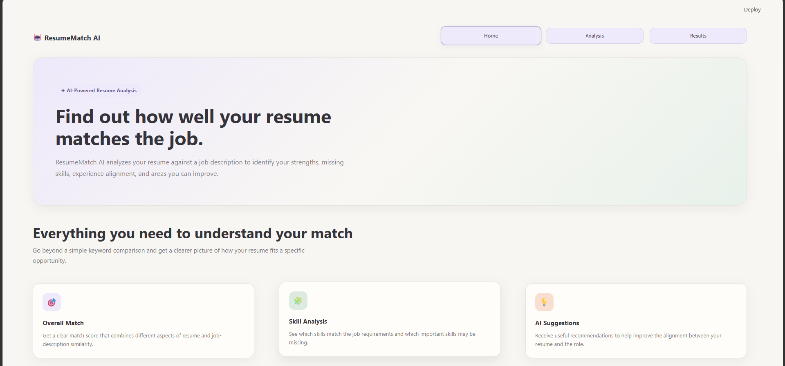
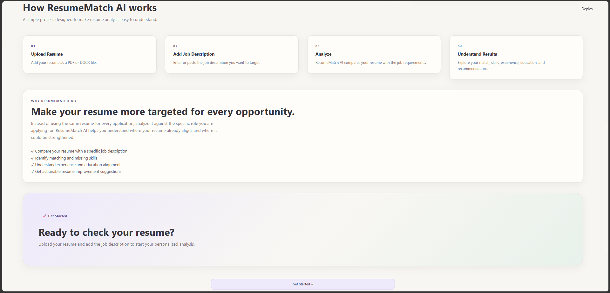
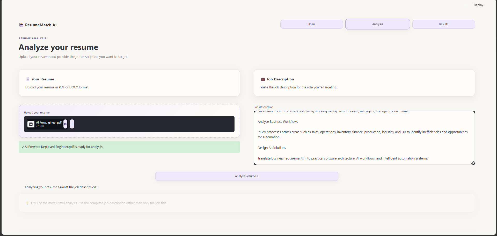
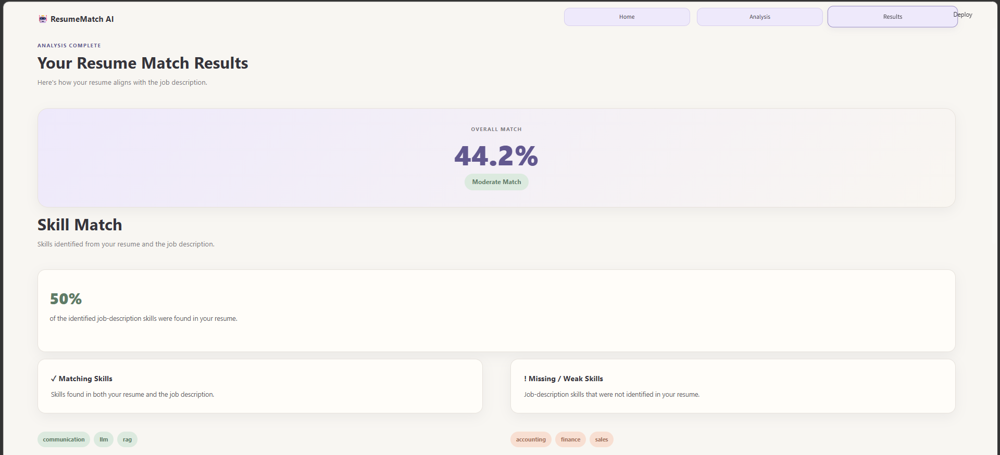
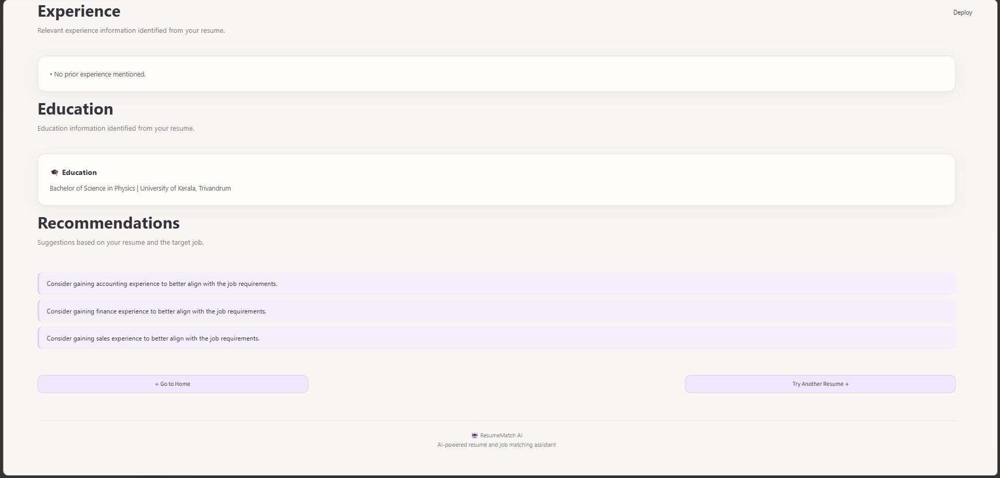

# AI Resume & Job Matching Assistant

An AI-powered resume and job matching application that combines traditional NLP, semantic similarity, skill extraction, hybrid scoring, and Retrieval-Augmented Generation (RAG) to analyze how well a resume matches a specific job description.

The application provides an interactive Streamlit dashboard that identifies matching skills, missing skills, relevant experience, education alignment, and personalized recommendations.

---

## 📸 Application Preview

### 🏠 Home Page





### 📄 Resume Analysis



### 📊 Match Results





---

## ✨ Key Features

- 📄 Upload resumes in PDF or DOCX format
- 📝 Enter a specific job description
- 🎯 Calculate an overall resume-job match score
- 🧩 Analyze skill overlap between resume and job description
- 🔎 Identify matching skills
- ⚠️ Identify missing or weak skills
- 💼 Extract relevant experience evidence
- 🎓 Extract education information
- 🤖 Generate AI-powered recommendations
- 🔍 Retrieve relevant resume sections using semantic search
- 🧠 Use a local LLM-based RAG pipeline
- 📊 Evaluate matching approaches using ROC-AUC
- 🌐 Interactive Streamlit web interface

---

## 🏗️ System Architecture

```text
                    ┌─────────────────────────┐
                    │   Resume + Job Input    │
                    └────────────┬────────────┘
                                 │
                                 ▼
                    ┌─────────────────────────┐
                    │   Document Extraction   │
                    │       PDF / DOCX        │
                    └────────────┬────────────┘
                                 │
              ┌──────────────────┼──────────────────┐
              │                  │                  │
              ▼                  ▼                  ▼
       ┌─────────────┐   ┌─────────────┐   ┌──────────────┐
       │   TF-IDF    │   │  Semantic   │   │    Skill     │
       │   Matching  │   │  Matching   │   │  Extraction  │
       └──────┬──────┘   └──────┬──────┘   └───────┬──────┘
              │                 │                  │
              └─────────────────┼──────────────────┘
                                │
                                ▼
                     ┌────────────────────┐
                     │   Hybrid Scoring   │
                     └──────────┬─────────┘
                                │
                                ▼
                     ┌────────────────────┐
                     │     RAG Pipeline   │
                     │  FAISS + Local LLM │
                     └──────────┬─────────┘
                                │
                                ▼
                     ┌────────────────────┐
                     │ Streamlit Dashboard│
                     └────────────────────┘